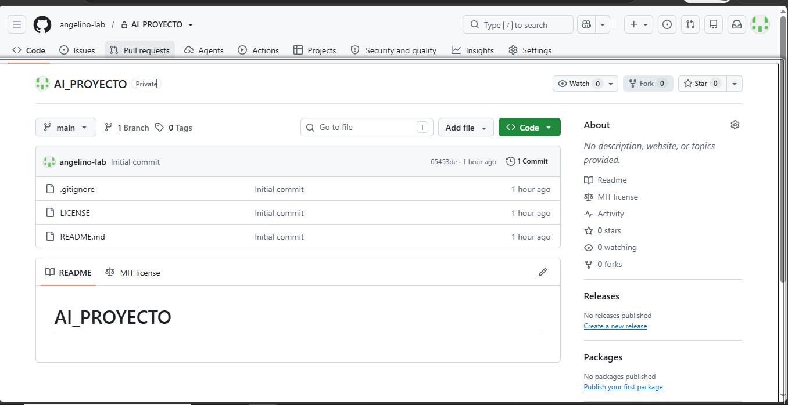
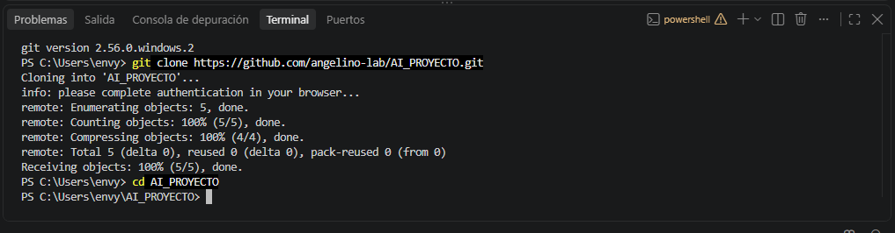
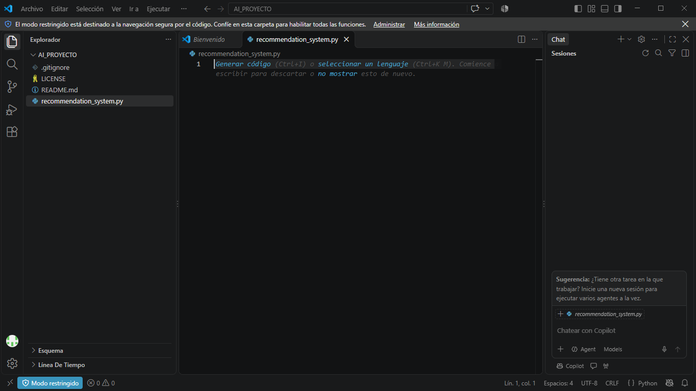
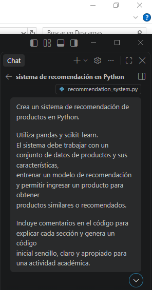
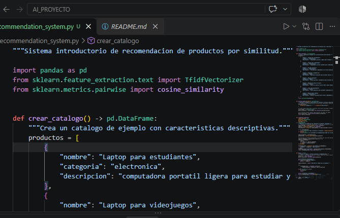

# Sistema de Recomendación de Productos con GitHub Copilot

## Tecnologías utilizadas

- Python
- GitHub Copilot
- Visual Studio Code
- Git y GitHub
- Pandas
- Scikit-learn

## 1. Creación del repositorio

se creo un repositorio con el nombre "AI_PROYECTO" Instalando un README y un gigitignore para python

## 2. Clonación del repositorio

Posteriormente, el repositorio fue clonado en el computador para trabajar localmente desde Visual Studio Code.

Para realizar la clonación se utilizó el comando:

git clone https://github.com/angelino-lab/AI_PROYECTO.git
y posteriormente entramos al archivo con el comando "cd AI_PROYECTO"

## 3. Creación del archivo Python

Dentro del repositorio se creó el archivo `recommendation_system.py`, en el cual se desarrolló el sistema de recomendación.

## 4. Uso de GitHub Copilot

Se utilizó GitHub Copilot desde Visual Studio Code para generar el código inicial del sistema.

Se solicitó a Copilot desarrollar un sistema de recomendación de productos utilizando Python, Pandas y Scikit-learn.

## 5. Funcionamiento del sistema

El programa utiliza Pandas para organizar y manejar el catálogo de productos.

Mediante Scikit-learn se utiliza TF-IDF para transformar las características y descripciones de los productos en una representación numérica. Posteriormente, se utiliza similitud coseno para comparar los productos y determinar cuáles presentan una mayor similitud.

El usuario puede ingresar el nombre de un producto y el sistema entrega hasta tres recomendaciones.

## 6. Ejecución y resultados

Para comprobar el funcionamiento del sistema se ejecutó el archivo `recommendation_system.py`.

Se utilizó como ejemplo el producto **"Laptop para estudiantes"**. El sistema analizó el catálogo y entregó los productos con mayor similitud.

![Ejecución del sistema 2]

La ejecución permitió comprobar que el programa funciona correctamente y genera recomendaciones basadas en las características de los productos.

## Conclusión

Esta actividad permitió aplicar GitHub Copilot como herramienta de apoyo para la generación de código y conocer su integración con Visual Studio Code.

Además, se utilizaron bibliotecas de Python como Pandas y Scikit-learn para desarrollar un sistema básico de recomendación. La actividad permitió comprender de manera práctica cómo una herramienta de inteligencia artificial puede apoyar el proceso de programación y desarrollo de soluciones.
